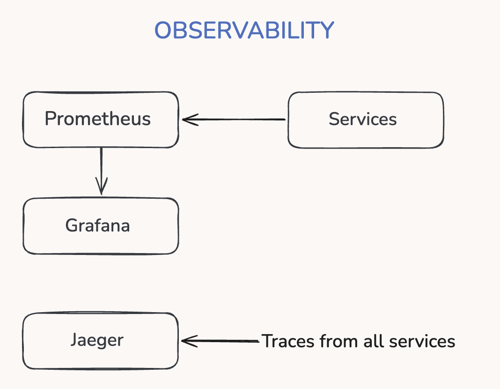
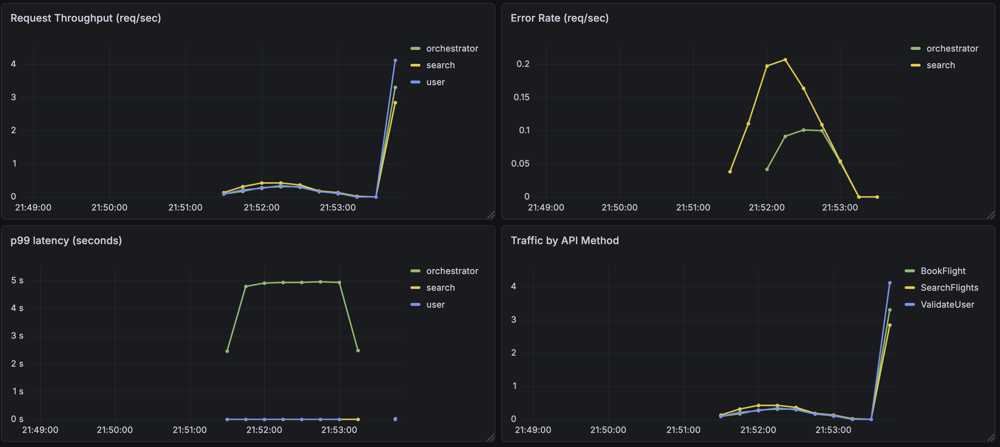
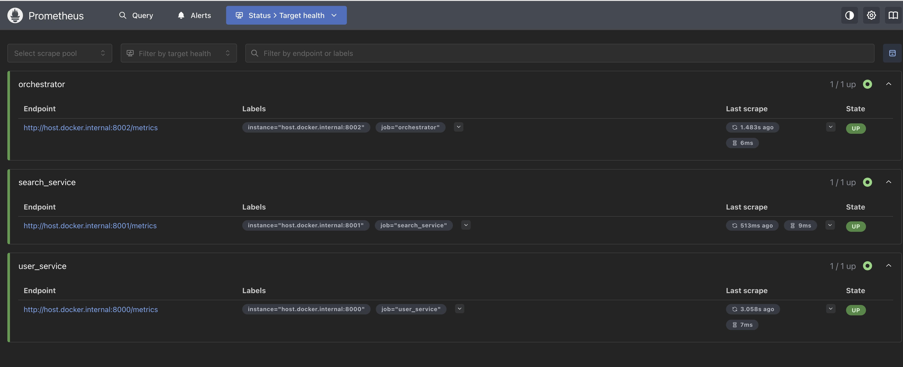
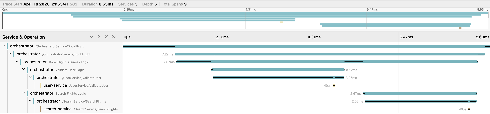

# Distributed Microservices Orchestration using gRPC

A production-style distributed microservices system built with Python and gRPC. It demonstrates service orchestration, resilience patterns with retries and circuit breaker logic, mutual TLS security, and end-to-end observability using Prometheus, Grafana, and OpenTelemetry.

## Overview

This system models a simple flight-booking workflow across three gRPC services:

- `Orchestrator Service` coordinates downstream requests and aggregates results
- `User Service` validates user eligibility
- `Search Service` returns flight results and supports server-side streaming

The system uses gRPC for service-to-service communication, mTLS for secure internal traffic, retry and circuit breaker logic for resilience, and tracing/metrics for operational visibility.

## Tech Stack

- Python
- gRPC and Protocol Buffers
- OpenTelemetry and Jaeger for distributed tracing
- Prometheus and Grafana for metrics and dashboards
- Docker Compose for the observability stack

## Setup

### 1. Install dependencies

```bash
python -m venv .venv
source .venv/bin/activate
pip install -r requirements.txt
```

### 2. Start the observability stack

```bash
docker compose up -d
```

Available services:

- Grafana: `http://localhost:3000`
- Prometheus: `http://localhost:9090`
- Jaeger: `http://localhost:16686`

Grafana login:

- Username: `admin`
- Password: `admin`

### 3. Run the gRPC services

Open separate terminals and start:

```bash
python services/user_server.py
python services/search_server.py
python services/orchestrator_server.py
```

### 4. Run the client

```bash
python clients/orchestrator_client.py
```

## Project Structure

```text
.
├── clients/
│   ├── orchestrator_client.py
│   ├── search_client.py
│   └── user_client.py
├── services/
│   ├── orchestrator_server.py
│   ├── search_server.py
│   └── user_server.py
├── shared/
│   ├── metrics.py
│   └── tracing.py
├── grpc_stubs/
├── proto/
├── certs/
├── docs/
├── docker-compose.yml
├── prometheus.yml
└── requirements.txt
```

- `clients/` contains simple clients for testing each service
- `services/` contains the three gRPC services
- `shared/` contains common tracing and metrics utilities
- `grpc_stubs/` contains generated protobuf and gRPC stub files
- `proto/` contains source `.proto` definitions
- `docs/` contains architecture notes and screenshots

## Key Features

- gRPC-based microservices communication
- Unary RPCs and server-side streaming
- Retry logic with exponential backoff
- Circuit breaker for downstream failure handling
- Mutual TLS (mTLS) between services
- Structured service logging for request and failure visibility
- Distributed tracing with OpenTelemetry
- Metrics collection with Prometheus and dashboarding with Grafana

## How to Test

### Standard flow

```bash
python clients/orchestrator_client.py
```

Request flow:

`Client -> Orchestrator -> User Service + Search Service`

### Streaming flow

Uncomment the streaming section in `clients/orchestrator_client.py` to observe live price updates flowing through the orchestrator.

### Failure testing

Enable the simulated failure block in `services/search_server.py` to trigger:

- retries
- circuit breaker behavior

## Observability

The system includes full observability across services:

- `Prometheus` for metrics collection
- `Grafana` for dashboards covering throughput, latency, and errors
- `Jaeger` for distributed trace visualization

Suggested demo flow:

1. Start the observability stack and all services
2. Send multiple client requests
3. Inspect the full request trace in Jaeger
4. Observe service metrics and latency trends in Grafana

## Observability Architecture



This diagram shows how Prometheus scrapes metrics from the services, Grafana visualizes those metrics, and Jaeger receives traces emitted by all services.

## Architecture

- a client sends requests to the orchestrator
- the orchestrator calls the user and search services over gRPC
- Prometheus scrapes service metrics
- Grafana visualizes the metrics
- OpenTelemetry exports traces to Jaeger

You can add a system diagram in [docs/architecture.md](/Users/sriram/Desktop/PROJECTS/Distributed%20Microservices%20Orchestration%20using%20gRPC/docs/architecture.md).

## Observability Dashboard



This dashboard should show request throughput, error rate, and latency across services under normal load and failure scenarios.

## Prometheus Target Health



This view confirms that Prometheus is successfully scraping the orchestrator, user service, and search service metrics endpoints.

## Distributed Tracing



This trace should capture the full request lifecycle, including:

- orchestrator business logic
- user validation call
- flight search call
- latency breakdown across each step

## Why This Project Stands Out

- Demonstrates distributed systems concepts beyond basic CRUD services
- Combines resilience, security, and observability in one cohesive project
- Uses both unary and streaming gRPC communication
- Applies mutual TLS and fault-tolerance patterns that are common in real service-to-service systems
- Includes end-to-end metrics, tracing, and logging so system behavior can be understood under both normal and failure scenarios

## Future Improvements

- Add centralized configuration management for service addresses, ports, TLS paths, and observability endpoints through environment variables or typed config files.
- Introduce health checks and readiness probes so each service can be monitored and restarted more safely in containerized deployments.
- Add request deadlines, graceful shutdown handling, and explicit gRPC status code mapping to improve reliability during failures and deployments.
- Expand observability with log correlation, alerting rules, and richer service-level metrics such as retry counts, circuit breaker state, and downstream call latency.
- Containerize the gRPC services and run the full application stack through Docker Compose so local development more closely mirrors a production deployment model.

## Let's Connect

If you'd like to discuss backend engineering, event-driven systems, AI or collaborate on similar projects, feel free to reach out.

- LinkedIn: [Sriram Vivek](https://www.linkedin.com/in/sriram-vivek/)
- Email: sriramv1202@gmail.com
